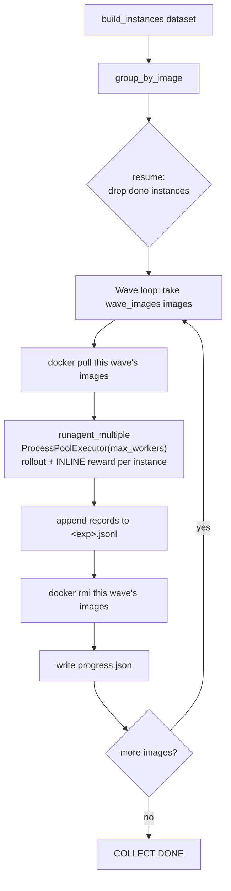

# Trajectory Collection

Image-grouped, resumable, disk-bounded driver for collecting SFT/RL agent
trajectories with R2E-Gym across **swegym**, **swesmith**, and **swerebench**,
using a served LLM (the multi-node SGLang router) as the rollout policy.

One command per dataset. Re-run the same command to resume. Disk usage is capped
regardless of dataset size. Reward is computed inline per instance.

```bash
./collect.sh swerebench            # collect ALL swerebench, default waves
./collect.sh swesmith 500 8 48     # first 500 swesmith, 8 images/wave, 48 workers
./collect.sh swegym 0 48 48        # ALL swegym
```

---

## Table of contents
1. [What it does](#what-it-does)
2. [How it works (the wave model)](#how-it-works-the-wave-model)
3. [Prerequisites](#prerequisites)
4. [Quick start](#quick-start)
5. [Files in this directory](#files-in-this-directory)
6. [Where results are stored](#where-results-are-stored)
7. [The trajectory record (jsonl schema)](#the-trajectory-record-jsonl-schema)
8. [Configuration — every option you can change](#configuration--every-option-you-can-change)
9. [`wave_images` vs `max_workers` (parallelism)](#wave_images-vs-max_workers-parallelism)
10. [Resume](#resume)
11. [Disk & image lifecycle](#disk--image-lifecycle)
12. [Reward computation](#reward-computation)
13. [Per-dataset reference](#per-dataset-reference)
14. [Recommended settings](#recommended-settings)
15. [Monitoring a running collection](#monitoring-a-running-collection)
16. [Troubleshooting](#troubleshooting)

---

## What it does

The driver gives four guarantees, each answering a real operational need:

| Guarantee | How |
|---|---|
| **Uniform & reproducible** | A run is fully described by `(dataset, model, k, wave_images, max_workers)`. Every knob is a flag with a sane default; the exact config is snapshotted to `config.json`. |
| **Resumable** | If interrupted (crash, Ctrl-C, server restart), re-run the *same* command. Instances already written to the run's `.jsonl` are skipped — no duplicates, no re-pull of a finished image's group. |
| **Disk-bounded** | Datasets are huge (swesmith ≈ 59k instances). We never pull everything. Images are processed in **waves**; a wave's images are pulled, used, then `docker rmi`'d before the next wave. Peak disk ≈ `wave_images × ~4 GB`. |
| **Reward inline** | R2E-Gym computes the reward in the *same container* right after the rollout. No separate eval stage, no second image pull, so per-wave offload is always safe. |

---

## How it works (the wave model)

Instances are grouped by their docker image. Images are processed `wave_images`
at a time. Within a wave, all instances run in parallel across `max_workers`
processes. After the wave drains, its images are removed and progress is saved.



Each wave is one `runagent_multiple` subprocess call into R2E-Gym
(`r2egym.agenthub.run.edit`). The agent reads the router URL from the environment
(`OPENAI_API_BASE`) and talks to the served model over the OpenAI-compatible API.

---

## Prerequisites

These must be true on the box you run from (the GCR dev box):

1. **The serving job is healthy.** The multi-node SGLang router must be up and its
   URL published to blob (`sglang_workers/<job>_router.json`). Verify:
   ```bash
   ./blob_sas.sh cat sglang_workers/sing_sglang_router_qwen35_397b_3node_v5_router.json
   # -> {"url": "https://....trycloudflare.com", ...}
   ```
   The driver re-reads this every run (the tunnel URL changes on restart). To
   **submit or monitor** the serving job itself, see [`serving/`](serving/README.md).
2. **Conda env `swe-master`** exists with R2E-Gym installed. Default interpreter:
   `/home/v-murongma/miniconda3/envs/swe-master/bin/python` (override with
   `SWE_MASTER_PY`).
3. **Docker daemon** running locally (rootless dockerd on `/var/run/docker.sock`),
   data root on `/datadisk` (~621 GB free). The driver auto-starts a `socat`
   bridge `127.0.0.1:2375 -> /var/run/docker.sock` (R2E-Gym hardcodes that TCP
   endpoint) and patches `DOCKER_TLS_VERIFY` off.
4. **`azcopy`** on PATH and the blob SAS cred at `../cred/zhibinmain_murongma_sas.url`
   (used by `blob_sas.sh` to resolve the router URL). Not needed if you pass
   `URL=...` yourself.

The driver runs a preflight at startup and aborts with a clear `FATAL:` message if
the router is unhealthy or docker TCP is unreachable.

---

## Quick start

```bash
cd SWE-Master/trajectory_collection

# 0) sanity: is the server up?
./blob_sas.sh cat sglang_workers/sing_sglang_router_qwen35_397b_3node_v5_router.json

# 1) tiny smoke test (2 instances, 2 images/wave, 4 workers)
./collect.sh swerebench 2 2 4

# 2) inspect results
ls collect_runs/swerebench_full/
wc -l collect_runs/swerebench_full/swerebench_full.jsonl

# 3) full collection (background, survives logout)
nohup ./collect.sh swerebench 0 8 48 > /tmp/swerebench.out 2>&1 &
```

> Tip: always run long collections under `nohup ... &` (or tmux). The run logs to
> `collect_runs/<exp>/run.log` regardless, so you can close the terminal.

---

## Files in this directory

| File | Role |
|---|---|
| `collect.sh` | **Entry point.** Thin wrapper: `./collect.sh <dataset> [K] [WAVE_IMAGES] [MAX_WORKERS]`. Maps positional args + env overrides to `collect.py` flags. |
| `collect.py` | **The driver.** Preflight, instance build/grouping, the wave loop (pull → run → rmi → progress), resume logic. |
| `build_dataset.py` | **Data layer.** `build_instances(dataset, limit, start)` → rollout-ready instances; `group_by_image()` → image→instances. Importable and runnable standalone for inspection. |
| `blob_sas.sh` | Reads the router URL (and other artifacts) the serving job published to blob. Uses the repo `cred/` SAS token. |
| `serving/` | **The rollout LLM.** amlt job specs + serve script + Docker image + watch scripts to stand up the multi-node SGLang router. See [serving/README.md](serving/README.md). |
| `collect_runs/` | **Output root** (created on first run, git-ignored). One subdir per experiment. |
| `README.md` | This document. |

---

## Where results are stored

Everything for one run lives under a single directory:
`collect_runs/<exp>/` (default `<exp> = <dataset>_full`, override with `EXP=`).

```
collect_runs/
└── swerebench_full/                  # <exp>
    ├── swerebench_full.jsonl         # ← THE OUTPUT: one trajectory record per line (append)
    ├── config.json                   # exact run config (dataset, model, k, knobs, host, start time)
    ├── progress.json                 # waves_done, instances_done/total, datadisk_free, elapsed_min
    ├── run.log                       # full driver + runagent log (wave lifecycle + agent steps)
    └── waves/
        ├── wave_0000.json            # the instance list fed to runagent_multiple for wave 0
        ├── wave_0001.json
        └── ...
```

- **The trajectories you want are in `<exp>.jsonl`.** Each line is one completed
  instance (rollout + reward), appended as it finishes. Safe to `tail -f`.
- `config.json` makes the run reproducible — it records every flag value used.
- `progress.json` is rewritten after every wave; it's the at-a-glance status and the
  resume aid.
- `waves/wave_XXXX.json` are audit artifacts (exactly which instances ran in each
  wave, including the per-instance docker image and, for swerebench, the
  `make_test_spec`).

Change the output root with `OUT_ROOT=/some/path ./collect.sh ...` (or
`--out_root`). `collect_runs/` is git-ignored so dumps never get committed.

---

## The trajectory record (jsonl schema)

Each line in `<exp>.jsonl` is the JSON record R2E-Gym writes per instance. The
fields you'll use most:

| Field | Meaning |
|---|---|
| `ds.instance_id` | the task id (used for resume matching) |
| `exit_reason` | `agent` (agent stopped), `max_steps`, error, … |
| `reward` | **1.0 = patch passed the held-out tests, 0.0 = failed.** Computed inline. |
| `trajectory_steps[]` | the full interaction, one entry per step |
| `trajectory_steps[].thought` | the model's reasoning (`<think>…`) for that step |
| `trajectory_steps[].action` | the tool call emitted (`<function=…>…`) |
| `trajectory_steps[].observation` | the tool/environment output |
| `output_patch` | the final code diff the agent produced |
| `max_steps` | step budget for the run |

(Plus R2E-Gym's standard bookkeeping: per-step exec times, token usage, etc.)

Quick inspection:
```bash
PY=/home/v-murongma/miniconda3/envs/swe-master/bin/python
$PY - collect_runs/swerebench_full/swerebench_full.jsonl <<'P'
import json,sys
for r in (json.loads(l) for l in open(sys.argv[1]) if l.strip()):
    ts=r.get("trajectory_steps") or []
    iid=(r.get("ds") or {}).get("instance_id")
    print(f"{iid:40s} reward={r.get('reward')} exit={r.get('exit_reason')} steps={len(ts)}")
P
```

---

## Configuration — every option you can change

### `collect.sh` positional args
| Pos | Name | Default | Meaning |
|---|---|---|---|
| `$1` | `DATASET` | *(required)* | `swegym` \| `swesmith` \| `swerebench` |
| `$2` | `K` | `0` | max instances to collect; **`0` = all** |
| `$3` | `WAVE_IMAGES` | `8` | images resident at once (peak disk ≈ N × 4 GB) |
| `$4` | `MAX_WORKERS` | `6` | parallel rollouts within a wave |

### `collect.sh` environment overrides
| Env var | Default | Meaning |
|---|---|---|
| `URL` | *(blob)* | router base URL; skip blob resolution |
| `TEMP` | `0.6` | sampling temperature |
| `MAX_STEPS` | `100` | max agent steps per instance |
| `USE_FN_CALLING` | `True` | use native function-calling scaffold |
| `SWE_MASTER_PY` | conda path | python interpreter |
| `OUT_ROOT` | `./collect_runs` | output root directory |
| `EXP` | `<dataset>_full` | experiment/run name (the subdir) |
| `ROUTER_JSON` | v5 router json | blob path of the router URL doc |

Example:
```bash
EXP=swesmith_run2 MAX_STEPS=80 TEMP=0.7 ./collect.sh swesmith 1000 8 48
```

### `collect.py` flags (full control)
`collect.sh` covers the common cases; for anything else call `collect.py` directly:

| Flag | Default | Meaning |
|---|---|---|
| `--dataset` | *(required)* | `swegym` \| `swesmith` \| `swerebench` |
| `--k` | all | max instances |
| `--start` | `0` | dataset start offset (slice `[start:start+k]`) |
| `--wave_images` | `8` | images resident per wave |
| `--max_workers` | `6` | parallel rollouts |
| `--model` | `Qwen/Qwen3.5-397B-A17B` | model id — **must equal the served `--model-path`** |
| `--url` | *(blob)* | router base URL |
| `--router_json` | v5 router json | blob path of the URL doc |
| `--max_steps` | `100` | agent step budget |
| `--max_tokens` | `131072` | per-call max tokens |
| `--temperature` | `0.6` | sampling temperature |
| `--use_fn_calling` | `True` | function-calling scaffold |
| `--out_root` | `./collect_runs` | output root |
| `--exp` | `<dataset>_full` | experiment name |
| `--keep_images` | *(off)* | **debug**: do NOT `docker rmi` after each wave |

```bash
SWE_MASTER_PY=/home/v-murongma/miniconda3/envs/swe-master/bin/python
$SWE_MASTER_PY collect.py --dataset swesmith --k 2000 --start 0 \
    --wave_images 8 --max_workers 48 --temperature 0.6 --exp swesmith_batch_a
```

> **`--model` must match the served model.** The router serves
> `Qwen/Qwen3.5-397B-A17B`; the id sent by the agent must be identical or SGLang
> rejects the request.

---

## `wave_images` vs `max_workers` (parallelism)

These two knobs are independent and control different things:

- **`wave_images`** = how many *images* are resident on disk at once → **bounds disk**.
- **`max_workers`** = how many *rollouts* run concurrently → **bounds compute/parallelism**.

A wave's task list is **all instances across its `wave_images` images**. Those tasks
are submitted to a `ProcessPoolExecutor(max_workers)`, so at any moment at most
`max_workers` rollouts run; the rest queue.

> **Parallel rollouts = `min(tasks_in_wave, max_workers)`.**

Worked examples for `wave_images=32`:

| Mapping | Tasks in a wave | Parallel rollouts | Images on disk |
|---|---|---|---|
| **1:1** (swegym, swerebench) | 32 (32 imgs × 1) | `min(32, workers)` | 32 |
| **N:1** (swesmith ≈ 266/img) | 32 × 266 ≈ 8,500 | `workers` (queue stays full) | 32 |

**Consequences:**
- For **1:1 datasets**, a wave only has `wave_images` tasks. If `max_workers >
  wave_images`, the extra workers sit idle. **Set `wave_images ≥ max_workers`** to
  use the whole pool (e.g. `48 48`).
- For **swesmith (N:1)**, even a few images yield thousands of tasks, so a small
  `wave_images` already keeps a large `max_workers` fully busy — and offloads /
  checkpoints sooner. Prefer a **small `wave_images`, large `max_workers`** (e.g.
  `8 48`).
- All `wave_images` images stay resident until the **whole wave** drains (they are
  not freed individually). Peak disk ≈ `wave_images × ~4 GB`.

---

## Resume

The collection is fully resumable. **Just re-run the identical command.**

Two layers protect against duplicates:
1. **Driver level:** instance ids already present in `<exp>.jsonl` are filtered out
   before waves are built. A fully-completed image's group is dropped entirely, so
   its image is never re-pulled.
2. **R2E-Gym level:** `runagent_multiple --use_existing True` independently skips
   instances whose problem statement is already in the output file.

What you'll see on a resume:
```
resume: 1234 instances already in swerebench_full.jsonl
pending: 5308 instances across 5308 images (skipped 1234 done)
```
and when everything is finished:
```
pending: 0 instances across 0 images (skipped 6542 done)
nothing to do — all instances already collected.
```

Resume keys on `instance_id`, so keep using the **same `EXP`/`--exp`** (the default
`<dataset>_full` is stable) to continue an existing run. Use a new `EXP` to start a
fresh, independent collection.

---

## Disk & image lifecycle

- Each instance's image is ~3–4.5 GB. The driver **pulls a wave, runs it, then
  `docker rmi`s exactly that wave's images** before the next wave.
- Peak disk ≈ `wave_images × ~4 GB`. With `/datadisk` ~621 GB free, `wave_images=48`
  (~192 GB) is comfortable; `wave_images=32` (~128 GB) is conservative.
- After each wave the free space is recorded in `progress.json` (`datadisk_free`)
  and `run.log` (`/datadisk free 614G`).
- `--keep_images` disables the per-wave `docker rmi` — **debug only**, it removes the
  disk bound and will fill the disk on a large dataset.
- If a `docker pull` fails for an image, that image's instances are dropped for the
  wave (logged `dropping image … — pull failed`) and the run continues.

---

## Reward computation

Reward is **inline, per instance, in the same container** — there is no separate
evaluation pass and no second image pull. In R2E-Gym's `runagent`
([`R2E-Gym/src/r2egym/agenthub/run/edit.py`](../R2E-Gym/src/r2egym/agenthub/run/edit.py)):

```python
reward, test_output = env.runtime._calculate_reward(get_test_output=True, ...)  # L422
...
env.close()                                                                     # L425
trajectory.reward = reward
```

`env.close()` stops/removes the *container* but never `docker rmi`s the *image*, so
the driver fully owns image lifecycle. By the time a wave's images are removed,
every rollout **and** its reward for those images are already computed and written
to the jsonl. `reward=1.0` means the agent's patch passed the held-out tests.

---

## Per-dataset reference

| Dataset | HF source (split) | Image naming | Size | Inst/image |
|---|---|---|---|---|
| **swegym** | `SWE-Gym/SWE-Gym` (train) | `xingyaoww/sweb.eval.x86_64.<iid with __→_s_>` (derived) | 2,438 | 1:1 |
| **swesmith** | `SWE-bench/SWE-smith` (train) | `jyangballin/swesmith.x86_64.*` (row `image_name`) | ~59k | **~266:1** |
| **swerebench** | `nebius/SWE-rebench` (`filtered`) | `swerebench/sweb.eval.x86_64.*` (row `docker_image`) | 6,542 | 1:1 |

Notes:
- All images are **public** (docker.io). The private harbor mirror is not reachable
  from the dev box and is not used.
- **swegym** rows have no image field; the image is derived from the instance id.
- **swerebench** rows get a JSON-string `make_test_spec` built via
  `swebench_fork_swerebench` so docker.py needs no GitHub fetch. Only rows whose
  `docker_image` starts with `swerebench/` are kept (the `filtered` split).
- **swesmith** is where image-grouping pays off most (~266 instances share one
  image) — a small `wave_images` already produces thousands of tasks per wave.

Inspect grouping without running anything:
```bash
$SWE_MASTER_PY build_dataset.py swesmith 1000
# swesmith: 1000 instances, 4 unique images (avg 250.0 inst/image) ...
```

---

## Recommended settings

`/datadisk` has ~621 GB free; images ≈ 4 GB.

| Dataset | Command | Why |
|---|---|---|
| swegym | `./collect.sh swegym 0 48 48` | 1:1 → `wave_images = workers` so all 48 run; ~192 GB peak |
| swerebench | `./collect.sh swerebench 0 48 48` | 1:1 → same reasoning; 6,542 instances |
| swesmith | `./collect.sh swesmith 0 8 48` | N:1 → 8 images already yield thousands of tasks; offload/checkpoint sooner; ~32 GB peak |

Start conservative to confirm throughput, then scale `max_workers` up while watching
`progress.json` `datadisk_free` and server health. The served replicas handle dozens
of concurrent rollouts; the practical ceiling is server throughput, not this driver.

Run in background:
```bash
nohup ./collect.sh swesmith 0 8 48 > /tmp/swesmith.out 2>&1 &
```

---

## Monitoring a running collection

```bash
EXP=swerebench_full   # or whatever you set

# at-a-glance status (updated every wave)
cat collect_runs/$EXP/progress.json

# wave lifecycle
grep -aE "WAVE|offloaded|progress|COLLECT DONE" collect_runs/$EXP/run.log

# live records being written
tail -f collect_runs/$EXP/$EXP.jsonl | \
  python -c 'import sys,json; [print(json.loads(l).get("ds",{}).get("instance_id"), json.loads(l).get("reward")) for l in sys.stdin]'

# count + reward distribution so far
PY=/home/v-murongma/miniconda3/envs/swe-master/bin/python
$PY - collect_runs/$EXP/$EXP.jsonl <<'P'
import json,sys,collections
c=collections.Counter()
n=0
for l in open(sys.argv[1]):
    if not l.strip(): continue
    n+=1; c[json.loads(l).get("reward")]+=1
print(f"records={n} reward_dist={dict(c)}")
P

# is it healthy? agent must hit the ROUTER, not localhost
grep -ac "localhost:8000" collect_runs/$EXP/run.log    # should be 0
grep -ac "trycloudflare" collect_runs/$EXP/run.log     # should be > 0
```

---

## Troubleshooting

| Symptom (in `run.log`) | Cause | Fix |
|---|---|---|
| `FATAL: router URL not healthy` | serving job down or tunnel changed | check the serving job; `./blob_sas.sh cat …router.json` to see the current URL |
| `FATAL: docker TCP 127.0.0.1:2375 not reachable` | dockerd / socat not up | ensure `dockerd` is running; the driver auto-starts socat but the daemon must exist |
| `llm base url: http://localhost:8000/v1` + `'OPENAI_API_KEY'` + `Can not write for Docker image` | the rollout subprocess didn't get the router env | already fixed (driver passes `env=` to the subprocess); if you forked the code, ensure `run_wave` keeps `env=env` |
| `Using fn calling: False` then `forgot to use a function call` every step | model id not in R2E-Gym's fn-calling allow-list | the repo's `agent.py` allow-list already includes `qwen3.5`; keep `--use_fn_calling True` and `--model Qwen/Qwen3.5-397B-A17B` |
| `pull FAILED <image>` | image missing/private or registry hiccup | that image's instances are skipped for the wave; verify the image exists publicly |
| disk filling up | running with `--keep_images`, or `wave_images` too high | drop `--keep_images`; lower `wave_images` |
| `HSA_STATUS_ERROR_OUT_OF_RESOURCES … Free mem : 0 MB` (server side) | GPU HBM OOM on the serving replica | a serving-side concern (use `MEM_FRAC=0.7`); the supervisor auto-restarts the replica and the driver resumes |

For serving-side issues, see the serving guide and the end-to-end playbook in
[`../copilot_memory/`](../copilot_memory/).
